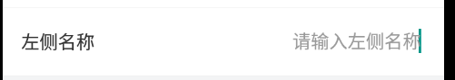

###### 刷新当前页面

> 示例

```
    1.需要在constructor中定义initPage并在当前页面A实现initPage方法,这样B页面跳转过来时会执行initPage方法
    constructor(props) {
        super(props)

        this.setParams({
            initPage : this.initPage
        })
    }

    2.如果当前页面A定义了initPage且有其他页面C跳转到此页面时不需要刷新A页面

        需要在C页面中将needRefresh置为false (默认为true)
        constructor(props) {
            super(props)

             this.setParams({
                needRefresh : false
            })
        }

    3.  导航栏分别是:  左侧返回  中间标题  后侧处理
        先有 从列表页A到编辑页B，
        1.点返回时需要刷新A(场景：列表页A 到详情页B 编辑是在C页， C 处理完回到B ，此时在B页点返回需要刷新A页)
        2.点返回不需要刷新A

        在B页重写backPress方法如下：
            constructor(props) {
                super(props)
                this.state = {
                    gBack : true, //默认点击返回键（即不操作页面）
                }
            }

            backPress(){
                if(this.state.gBack){ //默认点击返回了，不需要刷新前一个页面（自行控制）
                    this.setParams({
                        needRefresh : false
                    })
                    this.goBackToRoute("staffmanage", {title : "员工管理"})
                }else{ //若点击了保存，自行将gBack置为false,即可刷新A页面
                     this.goBackToRoute("staffmanage", {title : "员工管理"})
                 }
            }
```

<h3>Confirm</h3>

###### 组件功能

> 二次确认框

###### 支持平台

> android/iOS

###### 参数说明

> | 参数          | 是否必填 | 参数类型 | 说明                                      | 默认值 |
> | :------------ | :------- | :------- | :---------------------------------------- | :----- |
> | title         | false    | String   | 标题                                      |        |
> | content       | true     | String   | 内容                                      |        |
> | leftBnText    | false    | String   | 左侧 button 文案                          |        |
> | rightBnText   | false    | String   | 右侧 button 文案                          |        |
> | transparent   | false    | boolean  | 是否透明                                  | true   |
> | animationType | false    | String   | 通 RN 原 Modal 组件 （slide、fade、none） | fade   |
> | grayLayer     | false    | boolean  | 点击灰色区域是否退去 modal                | false  |

###### 示例

```
    <Confirm
        onLeftPress={() => {
            this.setState({ showConfirm: false })
        }}
        onRightPress={() => {
            this.setState({ showConfirm: false }, () => {
                this._goToList()
            })____
        }}
        modalVisible={this.state.showConfirm}
        content="comfirm的内容"
        rightBnText={"确定"}
    />
```

###### 图片展示


<h3>ModalSelect</h3>
    
###### 组件功能

> modal 中单/双选

###### 支持平台

> android/iOS

###### 参数说明

> | 参数         | 是否必填 | 参数类型 | 说明                           | 默认值   |
> | :----------- | :------- | :------- | :----------------------------- | :------- |
> | selectedList |          | Array    | 编辑时必填，初始化时选中的数据 | []       |
> | dataList     | true     | Array    | 需要渲染的元素集合             |          |
> | showName     | true     | String   | 需要展示的字段名称             |          |
> | idName       | true     | String   | dataList 中每项元素的唯一键值  |          |
> | onLeftPress  |          | function | 点击左侧按钮时所要做的事件     |          |
> | onRightPress |          | function | 点击右侧按钮时所要做的事件     |          |
> | type         | true     | String   | 单/双选                        | "single" |
> | grayLayer    | false    | boolean  | 点击灰色区域是否退去 modal     | false    |

###### 示例

```
    <ModalSelect
        modalVisible={this.state.showModalSelect}
        selectedList={[{ id: 1, name: "11" }]}
        dataList={[
            { id: 1, name: "11" },
            { id: 2, name: "2ddddddddddd2" },
            { id: 3, name: "33" },
            { id: 4, name: "44" },
            { id: 5, name: "55" }
        ]}
        idName="id"
        showName="name"
        onLeftPress={() => {
            this.setState({ showModalSelect: false })
        }}
        onRightPress={value => {
            console.log(value)
            this.setState({ showModalSelect: false })
        }}
    />
```

###### 图片展示


<h3>Uploading</h3>
    
###### 组件功能

> 上传图片时的加载进度蒙层

###### 支持平台

> android/iOS

###### 参数说明

> | 参数    | 是否必填 | 参数类型 | 说明         | 默认值 |
> | :------ | :------- | :------- | :----------- | :----- |
> | visible | true     | boolean  | 是否渲染蒙层 | false  |

###### 示例

```
   <Uploading visible={this.state.imgVisible} />
```

###### 图片展示


<h3>IFlatList</h3>
    
###### 组件功能

> 封装了原 RN 的 flatList

###### 支持平台

> android/iOS

###### 参数说明

> | 参数            | 是否必填 | 参数类型 | 说明                                                        | 默认值                                                                |
> | :-------------- | :------- | :------- | :---------------------------------------------------------- | :-------------------------------------------------------------------- |
> | url             | true     | String   | 网络请求                                                    |                                                                       |
> | refreshList     |          |          | 此属性变化表示要重新渲染组件（建议填 new Date().getTime()） |                                                                       |
> | style           | false    | Object   | flatList 样式                                               |                                                                       |
> | extraData       | true     |          | 同 flatList（建议传 this.state）                            |                                                                       |
> | children        | true     |          | 要渲染的行样式                                              |                                                                       |
> | data            | false    |          | 返回值，会反填到应用页面                                    | { dataList : [],pageNum : 0,totalCount : 0}                           |
> | id              | true     | String   | 行数据唯一属性名                                            |                                                                       |
> | cellHeight      | true     | Number   | 行高                                                        | 86                                                                    |
> | condition       | true     |          | 查询列表接口入参                                            | 在 this.state 中定义，格式为：condition : {pageNum : 0,pageSize : 10} |
> | isScrollEnabled | false    |          | 判断 flatList 是否可以滚动 (有侧滑时需要传)                 | false                                                                 |
> | extraData       | true     |          | 同 flatList（建议传 this.state）                            |                                                                       |
> | children        | true     |          | 要渲染的行样式                                              | true                                                                  |

###### 示例

```
    constructor(props) {
        super(props);

        this.state = {
            renderProp : "1",
            condition : {
                name : "",
                state : "1",
                pageNum : 0,
                pageSize : 10,
            },
            data : {
                dataList : [],
                pageNum : 0,
                totalCount : 0
            },
        };
    }

   <IFlatList
       renderProp={this.state.renderProp}
       extraData={this.state}
       data={this.state.data}
       id={"id"}
       url={"https://gatewaytest.bm001.com/itemmanage/item/queryProductList"}
       cellHeight={86}
       condition={this.state.condition}
       callBack={this._iflatListCallBack}
   >
       {this._renderItem}
   </IFlatList>

   _renderItem = ({item, index})=> {
       return (
           <View>
               这里绘制自己的页面
           </View>
       );
   };

   //回调，用户设置state中的值
       _iflatListCallBack = obj => {
           this.setState(obj)
       }
```

<h3>侧滑</h3>
    
###### 组件功能

> 对行数据进行侧滑处理

###### 支持平台

> android/iOS

###### 参数说明

> | 参数          | 是否必填 | 参数类型 | 说明                                                                                                                                                                                                                                                                                            | 默认值 |
> | :------------ | :------- | :------- | :---------------------------------------------------------------------------------------------------------------------------------------------------------------------------------------------------------------------------------------------------------------------------------------------- | :----- |
> | animated      | true     | String   | 侧滑动画效果（"cover", "together"）                                                                                                                                                                                                                                                             | cover  |
> | id            | true     | String   | 列表中行数据的唯一键                                                                                                                                                                                                                                                                            |        |
> | optId         | true     | String   | 前一次滑动的唯一键(需要在 constructor 中定义 this.optId)                                                                                                                                                                                                                                        |        |
> | refList       | true     |          | 列表中所有 RowCell 的实例，需要使用者在使用 RowCell 组件时添加属性 ref={(component)=>{this.refList.push(component)}}，                                                                                                                                                                          |        |
> | rightElement  | true     |          | 侧滑后右侧的展示内容。例：{text: "上架", btnStyle : {backgroundColor : "#cccccc", width : 65, height : 86}, textStyle : {fontSize : 16, color : "#FFFFFF"}（其中 btnStyle 对象是设置整个 button 的样式(这里的 height 要同行高)， textStyle 对象是设置 button 中文字描述的样式（限 text 样式）） |        |
> | stopDropdown  |          | function | 用于阻止 flatList 的滚动轴                                                                                                                                                                                                                                                                      |        |
> | queryDetail   |          | function | 点击查询详情, 返回行详细数据                                                                                                                                                                                                                                                                    |        |
> | rowInfo       | true     |          | 行详细信息                                                                                                                                                                                                                                                                                      |        |
> | pressCallBack | true     | function | 返回 rightElement 属性集合中的 index 位置                                                                                                                                                                                                                                                       |        |

###### 示例

```
    constructor(props) {
        super(props);

        this.state = {
            isScrollEnabled : true, // 判断flatList是否可以滚动
        };

        this.optId = -1;
    }

   <RowCell
       rightElement={[
           {text: "上架",
               btnStyle : {backgroundColor : "#cccccc", width : 65, height : 86},
               textStyle : {fontSize : 16, color : "#FFFFFF"}
           },
           {text: "删除",
               btnStyle : {backgroundColor : "#FE3B31", width : 65, height : 86},
               textStyle : {fontSize : 16, color : "#FFFFFF"}
           },
           {text: "删除2",
               btnStyle : {backgroundColor : "#40b0ff", width : 65, height : 86},
               textStyle : {fontSize : 16, color : "#FFFFFF"}
           }]}
       stopDropdown={this._stopDropdown}
       optId={this.optId}
       ref={(component)=>{this.refList.push(component)}}
       refList={this.refList}
       id ={item.id}
       rowInfo={item}
       queryDetail={this._queryDetail}
       pressCallBack={this._pressCallBack}
       preId = {this._preId}
   >
       <View>
           这里绘制自己的页面
       </View>
   </RowCell>

   //阻止flatList 下拉
   _stopDropdown = (value) => {
       console.log("stop...", value)
       this.setState({
           isScrollEnabled : value
       })
   }

    /*隐藏前一个的id显示*/
   _preId = (inputId)=>{
       this.optId = inputId;
   }

   _queryDetail = (data) => {
       console.log(`点击行，查询行详情`, data)
   }

   _pressCallBack = (data, index) => {
       console.log("返回行详情数据", data)
       console.log(`返回在rightElement属性集合中的index : ${index}`)
   }
```

###### 图片展示


<h3>虚线</h3>
    
###### 组件功能

> 绘制横/竖虚线

###### 支持平台

> android/iOS

###### 参数说明

> | 参数      | 是否必填 | 参数类型 | 说明                               | 默认值 |
> | :-------- | :------- | :------- | :--------------------------------- | :----- |
> | type      | true     | String   | 代表要绘制虚线还是横线             | row    |
> | height    | true     | Number   | 虚线的高度                         | 2      |
> | width     | true     | Number   | 虚线的宽度                         | 1      |
> | space     | true     | Number   | 虚线间间距                         | 3      |
> | style     |          |          | 虚线的背景颜色                     |        |
> | lineStyle |          |          | 虚线的样式（主要用于设置线的颜色） |        |
> | length    | true     | Number   | 是否渲染蒙层                       | false  |
> | visible   | true     | boolean  | 虚线要展示的最大长度               | 屏宽   |

###### 示例

```
   <DashLine
       style={{ backgroundColor: "#ffffff", marginLeft: 6}}
       lineStyle={{backgroundColor: "#999999"}}
       type="row"
       height={1}
       width={2}
       space={3}
       length={59}
       />
```

###### 图片展示


<h3>计数器</h3>
    
###### 组件功能

> 点击减号内容减一，点击加号内容加一

###### 支持平台

> android/iOS

###### 参数说明

> | 参数     | 是否必填 | 参数类型 | 说明         | 默认值 |
> | :------- | :------- | :------- | :----------- | :----- |
> | leftName | true     | String   | 左侧文案     |        |
> | value    |          |          | 展示内容     |        |
> | onBack   |          | function | 点击回调函数 |        |

###### 示例

```
   <Counter
       leftName={"选择数量"}
       value={this.state.count}
       style={styles.wigetStyle}
       onBack={num => this.setState({ count: num })}
   />
```

###### 图片展示


<h3>添加组件</h3>
    
###### 组件功能

> 加号表示，点击做添加操作

###### 支持平台

> android/iOS

###### 参数说明

> | 参数          | 是否必填 | 参数类型 | 说明            | 默认值 |
> | :------------ | :------- | :------- | :-------------- | :----- |
> | describe      | true     | String   | 描述文字        |        |
> | describeStyle |          |          | 描述样式        |        |
> | style         |          |          | 行样式          |        |
> | iconStyle     |          |          | icon 的父级样式 |        |
> | bmIconStyle   |          |          | icon 样式       |        |

###### 示例

```
   <AddButton
       style={styles.wigetStyle}
       describe={"添加商品"}
       add={() => {
           console.log("回调")
       }}
   />
```

###### 图片展示


<h3>展示行元素</h3>
    
###### 组件功能

> 展示行元素

###### 支持平台

> android/iOS

###### 参数说明

> | 参数       | 是否必填 | 参数类型 | 说明           | 默认值 |
> | :--------- | :------- | :------- | :------------- | :----- |
> | leftName   | true     | String   | 左侧描述文字   |        |
> | rightName  | true     | String   | 右侧描述文字   |        |
> | style      |          |          | 行样式         |        |
> | leftStyle  |          |          | 左侧文字样式   |        |
> | rightStyle |          |          | 右侧文字样式式 |        |

###### 示例

```
   <InfoRow
       style={styles.wigetStyle}
       rightName={"左侧展示的名称"}
       value={"右侧展示的内容"}
   />
```

###### 图片展示


<h3>行输入框</h3>
    
###### 组件功能

> 行输入框

###### 支持平台

> android/iOS

###### 参数说明

> | 参数                 | 是否必填 | 参数类型 | 说明                 | 默认值  |
> | :------------------- | :------- | :------- | :------------------- | :------ |
> | rightName            | true     | String   | 右侧描述文字         |         |
> | value                |          |          | 输入的值             |         |
> | placeholder          |          |          | 未输入值前的文案     |         |
> | placeholderTextColor |          |          | 未输入值前的文案样式 | #999999 |
> | style                |          |          | 行样式               |         |
> | leftStyle            |          |          | 左侧字体的样式       |         |
> | rightStyle           |          |          | 右侧字体的样式       |         |
> | unit                 |          |          | 单位                 |         |
> | unitStyle            |          |          | 单位的样式           |         |
> | iInputCallBack       |          |          | 输入回调             |         |
> | keyboardType         |          |          | 键盘格式             | default |

###### 示例

```
   <IInput
       rightName={"左侧名称"}
       placeholder={"请输入左侧名称"}
       placeholderTextColor={MainStyle.font.color.color4}
       value={this.state.inputVal}
       iInputCallBack={value => {
           this.setState({ inputVal: value })
       }}
       style={[styles.wigetStyle]}
       rightStyle={[{ fontSize: MainStyle.font.size.size16, color: MainStyle.font.color.color4 }]}
       maxLength={11}
       keyboardType={"numeric"}
   />
```

###### 图片展示



<h3>搜索框</h3>
    
###### 组件功能

> 搜索框

###### 支持平台

> android/iOS

###### 参数说明

> | 参数             | 是否必填 | 参数类型 | 说明                                              | 默认值 |
> | :--------------- | :------- | :------- | :------------------------------------------------ | :----- |
> | textChangeAction |          |          | 文字改变事件回调函数 传参为当前输入框中的文字     |        |
> | searchAction     |          |          | 搜索按钮点击事件回调函数 传参为当前输入框中的文字 |        |
> | placeholder      |          |          | 未输入值前的文案                                  |        |
> | text             |          |          | 搜索框内容                                        |        |

###### 示例

```
   <SearchBar
       placeholder={"请输入搜索内容"}
       searchAction={value => {
           console.log(value)
       }}
       textChangeAction={text => {
           if (__DEV__) {
               console.log("改变", text)
           }
       }}
   />
```

###### 图片展示


<h3>Picker</h3>
    
###### 组件功能

> 未进行封装的 Picker

###### 支持平台

> android/iOS

###### 参数说明

> | 参数             | 是否必填 | 参数类型 | 说明                                                 | 默认值 |
> | :--------------- | :------- | :------- | :--------------------------------------------------- | :----- |
> | dataSource       | true     | Arrry    | 数据源集合                                           |        |
> | value            |          |          | 选中的值                                             |        |
> | placeholder      |          |          | 未输入值前的文案                                     |        |
> | field            |          |          | dataSource 中元素为对象时必填（picker 要展示的字段） |        |
> | tips             |          | String   | 提示语                                               |        |
> | rightStyle       |          |          | 右侧整体的样式                                       |        |
> | rightTextStyle   |          |          | 右侧字体的样式                                       |        |
> | hasChildren      |          |          | 判断是否有自定义内容                                 | false  |
> | placeholderStyle |          |          | 默认提示的样式                                       |        |
> | labelText        | true     |          | 左侧文案                                             |        |

###### 示例

```
    <Picker
        labelText="字符串集合"
        dataSource={["name1", "name2", "name3", "name4"]}
        valueStyle={{
            fontSize: MainStyle.font.size.size16,
            color: MainStyle.font.color.color3
        }}
        style={[{
            backgroundColor: MainStyle.background.color.assit3,
            height: 60,
            paddingLeft: 16}, styles.wigetStyle]}
        single={true}
        value={this.state.selectLevel}
        property="selectLevel"
        haveText={false}
        placeholder="请选择"
        onChange={data => {
            console.log(data[0])
            // this.setState({ selectLevel: data.length ? data[0] : "" })
        }}
    />

    <Picker
        labelText="对象集合"
        dataSource={[{id : 1, name : "name1"}, {id : 2, name : "name2"}, {id : 3, name : "name3"}, {id : 4, name : "name4"}]}
        field={"name"}
        property="sex"
        placeholder="请选择套餐卡名称"
        placeholderStyle={{fontSize : MainStyle.font.size.size16, color : MainStyle.font.color.color4}}
        tips={"没有可选择的套餐卡"}
        editable={true}
        // value={condition.cardName ? condition.cardName : ""}
        onChange={(d)=>console.log(d)}
        style={[{height : 60}, styles.wigetStyle]}
    />
```

###### 图片展示


<h3>ISinglePicker</h3>
    
###### 组件功能

> 封装了 Picker

###### 支持平台

> android/iOS

###### 参数说明

> | 参数             | 是否必填 | 参数类型 | 说明                                                 | 默认值 |
> | :--------------- | :------- | :------- | :--------------------------------------------------- | :----- |
> | labelText        | true     |          | 左侧文案                                             |        |
> | dataSource       | true     | Arrry    | 数据源集合                                           |        |
> | value            |          |          | 选中的值                                             |        |
> | placeholder      |          |          | 未输入值前的文案                                     |        |
> | field            |          |          | dataSource 中元素为对象时必填（picker 要展示的字段） |        |
> | style            |          |          | 单元行的样式                                         |        |
> | valueStyle       |          |          | 选中后字体的样式                                     |        |
> | leftStyle        |          |          | 左侧字体的样式                                       |        |
> | rightStyle       |          |          | 右侧整体的样式                                       |        |
> | rightTextStyle   |          |          | 右侧字体的样式                                       |        |
> | tips             |          | String   | 提示语                                               |        |
> | rightStyle       |          |          | 右侧整体的样式                                       |        |
> | rightTextStyle   |          |          | 右侧字体的样式                                       |        |
> | hasChildren      |          |          | 判断是否有自定义内容                                 | false  |
> | placeholderStyle |          |          | 默认提示的样式                                       |        |

###### 示例

```
   <ISinglePicker
       style={styles.wigetStyle}
       labelText="IPicker"
       dataSource={[{id : 1, name : "name1"}, {id : 2, name : "name2"}, {id : 3, name : "name3"}, {id : 4, name : "name4"}]}
       field={"name"}
       property="rebate"
       placeholder="请选择"
       placeholderStyle={{color : MainStyle.font.color.color3}}
       value={""}
       editable={true}
       onChange={(value)=>console.log(value)}
   />
```

<h3>时间选择器</h3>
    
###### 组件功能

> 时间选择器

###### 支持平台

> android/iOS

###### 参数说明

> | 参数              | 是否必填 | 参数类型 | 说明                                      | 默认值   |
> | :---------------- | :------- | :------- | :---------------------------------------- | :------- |
> | labelText         | true     |          | 左侧文案                                  |          |
> | labelStyle        |          | object   | labelText 的文案样式                      |          |
> | returnValueFormat |          | string   | 返回时间字符串样式，例如 YYYY-MM-DD HH:mm |          |
> | startTime         |          |          | 可选择的最早时间                          |          |
> | lastTime          |          |          | 可选择的最晚时间                          |          |
> | value             |          |          | 选择的值                                  |          |
> | placeholder       |          |          | 选择提示文案                              |          |
> | placeholderStyle  |          |          | 选择提示文案样式                          |          |
> | style             |          |          | 行整体样式                                |          |
> | timeMode          |          |          | 时间选择器的类型                          | datetime |

###### 示例

```
   <IDatePicker
       labelText={"IDatePicker"}
       // labelStyle={{fontSize : MainStyle.font.size.size14, color : MainStyle.font.color.color3}}
       timeMode="date"
       returnValueFormat={"YYYY-MM-DD"}
       startTime={new Date().format("yyyy-MM-dd")}
       // lastTime={new Date(new Date().setFullYear(new Date().getFullYear() + 1)).format(
       //     "yyyy-MM-dd hh:mm"
       // )}
       // startTime={new Date().format("yyyy-MM-dd hh:mm")}
       placeholder="请选择具体小时"
       // placeholderStyle={{fontSize : MainStyle.font.size.size14, color : MainStyle.font.color.color4}}
       // value={""}
       valueStyle={{fontSize : MainStyle.font.size.size14, color : MainStyle.font.color.color3}}
       onSelect={(value)=>console.log(value)}
       style={styles.wigetStyle}
    />
```
